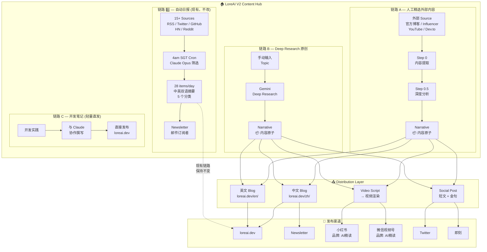
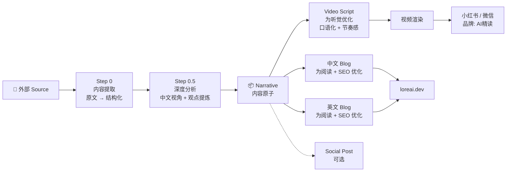
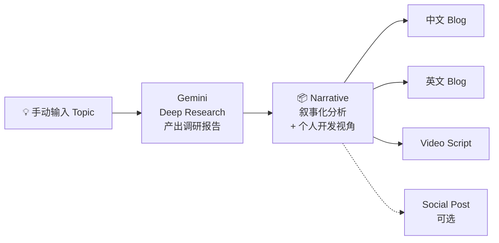
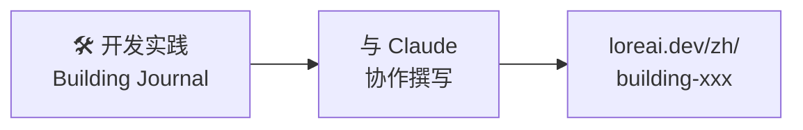
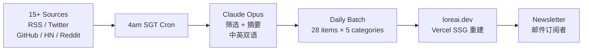

# LoreAI V2 Content Hub — 内容流转架构图 v3

## 核心理念

> Canonical ≠ Blog。Canonical = Narrative（叙事化深度分析）。
> Blog、Video、Social Post 都是从 Narrative 平行派生的 output format。
> 不同类型的内容走不同复杂度的链路。

---

## 架构总览



---

## 链路 A 详解：人工精选外部内容



**升级点：** 之前 blog2video 只产出视频。现在从 Narrative 同时产出 Blog + Video。

---

## 链路 B 详解：Deep Research 原创内容



**关键决策：Video 从 Narrative 分叉，不从 Blog 分叉。**
- Blog 为阅读优化（长段落、小标题、SEO 关键词）
- Video Script 为听觉优化（短句、口语化、节奏感）
- 两者平行派生，避免 blog → video 的格式转换损耗

---

## 链路 C 详解：开发笔记直发



**最短链路，零中间步骤。** 写完即发，不走 Narrative，不生成视频。

---

## 链路 0 详解：自动日报（现有，保持不变）



**这条链路完全不变。** 它是 LoreAI 的基础内容层，与链路 A/B/C 共存。

---

## 四条链路对比

| | 0️⃣ 自动日报 | A 精选外部 | B Deep Research | C 开发笔记 |
|---|---|---|---|---|
| **输入** | 15+ RSS/API | 人工选 URL | 人工选 Topic | 开发经验 |
| **处理** | Claude 筛选+摘要 | Step 0 → 0.5 → Narrative | Deep Research → Narrative | Claude 协作撰写 |
| **Canonical** | Daily batch item | Narrative | Narrative | Blog 本身 |
| **Blog** | ✅ 摘要卡片 | ✅ 中英深度文章 | ✅ 中英深度文章 | ✅ 直发 |
| **Video** | ❌ | ✅ 从 Narrative | ✅ 从 Narrative | ❌ |
| **Social** | ❌ | ✅ 可选 | ✅ 可选 | ❌ |
| **自动化** | 全自动 | 半自动 | 半自动 | 手动 |
| **状态** | ✅ 已上线 | 🔨 待建 | 🔨 待建 | 🔨 待建 |

---

## 关键设计决策

| 决策 | 选择 | 原因 |
|------|------|------|
| Canonical 是什么 | Narrative（叙事化分析） | 最灵活的中间产物，可派生任何格式 |
| Video 从哪分叉 | 从 Narrative，不从 Blog | 避免"阅读格式→听觉格式"的转换损耗 |
| 自动日报改不改 | 不改 | 已稳定运行，与新链路独立共存 |
| 开发笔记走什么链路 | 直发 | 轻量内容不需要 Narrative 层 |
| Video 品牌 | 保持 "AI精读" | 社交媒体已有品牌认知 |
| 分发决策谁做 | 人工决定 | 不是所有内容都适合所有格式 |

---

## 数据流示例

### 例 1：Anthropic 发了 Claude 4 博客（链路 A）
```
Anthropic blog URL
  → Step 0（提取英文原文 + 结构化）
  → Step 0.5（深度分析：技术解读 + 开发者影响）
  → Narrative
      ├→ 中文 Blog → loreai.dev/zh/claude-4-deep-dive
      ├→ 英文 Blog → loreai.dev/en/claude-4-deep-dive
      ├→ Video Script → AI精读视频 → 小红书/微信
      └→ Social Post → Twitter thread + 即刻
```

### 例 2：研究 "AI Agent 架构模式"（链路 B）
```
Topic: "AI Agent 架构模式"
  → Gemini Deep Research（产出调研报告）
  → Narrative 生成（加入个人开发实践视角）
      ├→ 中文 Blog → loreai.dev/zh/ai-agent-patterns
      ├→ 英文 Blog → loreai.dev/en/ai-agent-patterns
      └→ Video Script → AI精读深度解析 → 小红书
```

### 例 3：写了一个 MCP Server 的开发心得（链路 C）
```
开发笔记
  → 与 Claude 协作撰写
  → 直接发布 → loreai.dev/zh/building-mcp-server
```

### 例 4：每日自动日报（链路 0，现有）
```
15+ sources 每日更新
  → 4am SGT cron 触发
  → Claude Opus 筛选 28 items
  → 生成中英双语摘要
  → Vercel SSG 重建 → loreai.dev
  → Newsletter 推送
```
